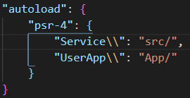
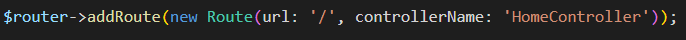
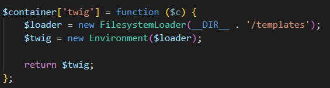
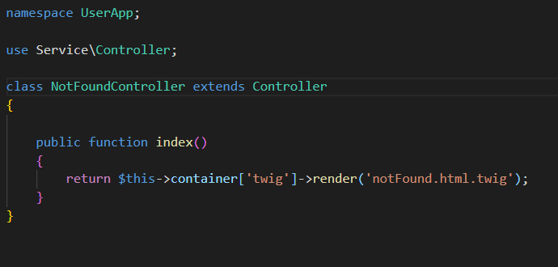

# TP : Challenge

Groupe : Julien - Pierre

## Sujet

Lien du Sujet
: https://github.com/Antoine07/leaddev_02/blob/main/05_DESIGN_PATTERNS/Challenge/01_sujet_framework.md

## Doc

Ce framework sert à gérer dynamiquement les pages affichées à l’utilisateur quand il accède à une url.

## Design utilisé

Ce framework utilise un dispatcher pour gérer la gestion des routes.

## Installation

Il faut initialiser composer en utilisant la méthode suivante :

```
composer init
```

Il faut ensuite installer Twig :

```
composer require "twig/twig"
```

et modifier le fichier composer.json pour y ajouter l'autoloading :



Il faut ensuite générer l'autoloader avec les namespaces que nous venons d'ajouter :

```
composer dump-autoload
```

## Router

Pour ajouter une nouvelle page, il faut :

1. Ajouter un nouveau Controller dans le dossier App
2. Ajouter une nouvelle route dans le fichier app.php en lui assignant une URL et le nom du controller

   

3. Créer, dans le fichier app.php, une fonction anonyme qui sera appelée dans le controller

   

## Templates

Ce framework utilise Twig pour gérer les templates.
Le dossier templates contient les différents fichiers de templates, il faudra créer un nouveau fichier pour chaque nouvelle page.

## Model

Il existe un model de Route, à sa constructio, il faudra au moins lui assigner un nom et un nom de controller :

```
private string $url,
private string $controllerName,
private string $action = "index",
private string $namespaceController = "UserApp"
```

## Example de controller



## Lancer le serveur local

Pour lancer le serveur en local, il faut utiliser la commande suivante :

```
php -S localhost:8000 -t public/
```
